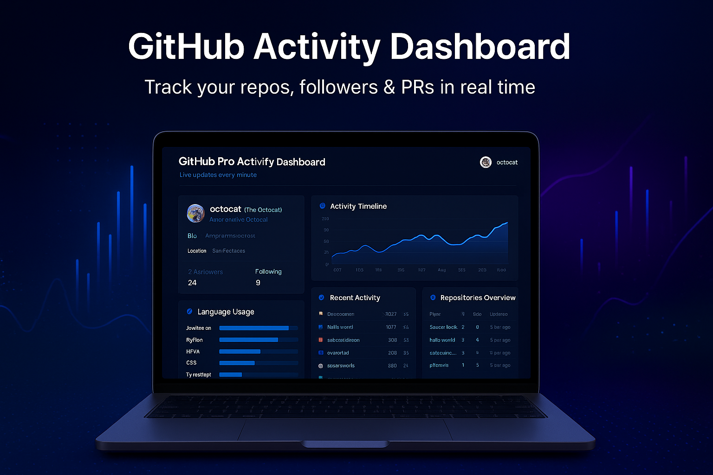

# 🐙 GitHub Pro Activity Dashboard

A beautiful **Streamlit-based dashboard** that visualizes GitHub activity — including repositories, languages, followers, PRs, issues, and event timelines.  
Perfect for developers who want to **analyze and showcase their GitHub performance** in real time. 🚀  

---

## 🌟 Features

✅ **Live GitHub User Tracking** — view activity by simply entering a username  
📦 **Repository Overview** — see all your public repos with stars, forks & updates  
💻 **Language Breakdown** — top languages used with usage percentage table  
📅 **Activity Timeline** — visualize when you push, fork, or star projects  
🕒 **Recent Events Feed** — shows latest commits, pushes, PRs, and more  
🔄 **Auto-Refresh Option** — updates data automatically every few seconds  
🌈 **Modern UI** — dark gradient background, glowing charts, clean design  

---

## 🖼️ Screenshot

> 🎨 Example dashboard view



*(You can replace the above image with your actual screenshot — `assets/dashboard_preview.png`)*

---

## ⚙️ Installation & Usage

### 1️⃣ Clone the Repository
```bash
git clone https://github.com/ZohaiAli/github-pro-dashboard.git
cd github-pro-dashboard
```
**2️⃣ Install Dependencies**
```bash
pip install -r requirements.txt
```

If you don’t have a requirements.txt, just install manually:

pip install streamlit requests matplotlib pandas

**3️⃣ Run the App**

```bash 
streamlit run app.py
```

**4️⃣ Open in Browser**

Streamlit will open automatically at:
👉 http://localhost:8501

Enter a GitHub username (e.g. ZohaibAli) and hit Show Dashboard 🚀

📊 Example Use Case

Track your own GitHub contributions and progress

Compare different accounts’ coding activity

Use charts and insights for your LinkedIn portfolio post

Great for developers building data dashboards or API-based apps

**🧠 Tech Stack**

Component	Description
Python	Main programming language
Streamlit	Interactive web UI
GitHub REST API	Data source for user info, repos & events
Matplotlib / Pandas	For charts & data visualization

**⚠️ Notes**

GitHub API allows only 60 requests/hour (unauthenticated).
So avoid too many refreshes — or you can add a personal access token later.

Only public data is shown (private repos are not accessible).

**💖 Contributing**

Pull requests are welcome!
If you find bugs or have ideas, open an issue or submit a PR.

**📜 License**

This project is open-source and available under the MIT License.

**👨‍💻 Author**

**Syed Zohaib Ali / Syed Azeem Hashmi
**


**⭐ If you like this project, don’t forget to star the repo on GitHub!


---

Would you like me to make a **README with emojis, badges, and sections auto-centered (like)**

